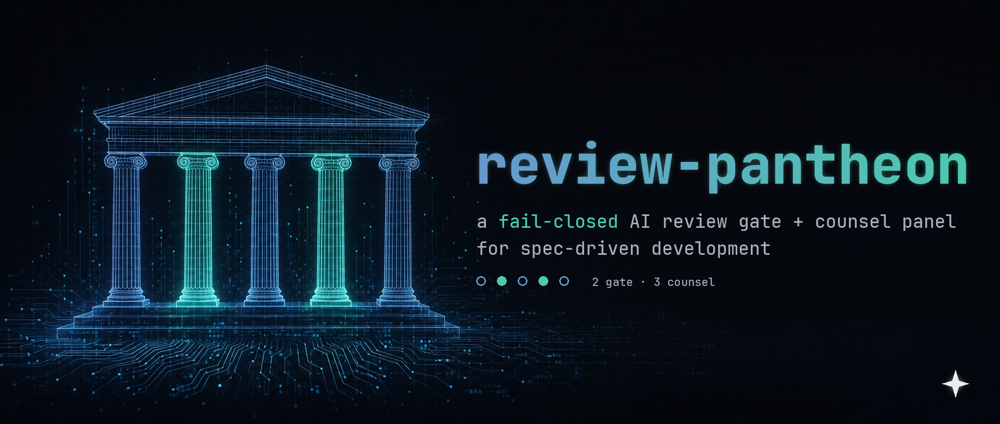

<div align="center">




[](https://github.com/G-Schumacher44/review-pantheon/actions/workflows/ci.yml)
[](LICENSE)
[](#how-the-gate-stays-honest)
[](#provider-lanes)

</div>

# review-pantheon — a fail-closed AI review gate and counsel panel for spec-driven development

- AI-assisted, spec-driven development produces work faster than a human can independently
  verify it — the bottleneck moves from writing the change to trusting the report of it.
- Most "AI code review" collapses two different questions into one pass: does the diff look
  right, and did the PR actually do what it claims. A single reviewer answering both tends to
  skim the code for red flags and take the description mostly on faith.
- A pass with no fail-closed rule turns a missing, empty, or malformed verdict into a quiet
  green — the one failure mode that's worse than an honest red.

## What review-pantheon is

A portable review gate — a GitHub Action plus a provider-agnostic CLI — built around **five
read-only agent personas** (`agents/*.md`), split into two tiers: two **gate agents** (Artemis,
Apollo) whose verdicts enforce and can block a merge, and three **counsel agents** (Socrates,
Diogenes, Plato) whose verdicts inform a human decision and never gate.

The verdict-decision rule — trailing-JSON extraction, schema validation, the blocker invariant —
is implemented **twice, once per runtime** (`cli/lib/verdict.sh` in bash, `action/decide_verdict.py`
in Python); a cross-runner fixture test in CI keeps the two in sync. **4 provider lanes**
(`cli/providers/{claude,codex,gemini,cursor}.sh`) plug into the same CLI. Claude is the
integration-tested lane; Codex, Gemini, and Cursor are best-effort by design and fail closed the
same way an unparseable verdict does — see [Provider lanes](#provider-lanes) for the
verified-vs-best-effort matrix. The GitHub Action's permissions are `contents: read` and
`pull-requests: write` — no write access beyond posting one PR comment.

review-pantheon is built for teams where a written spec is the contract, not a suggestion someone
skims once and stops checking: `DESIGN.md` in this repo is itself that contract — its rule 5 says
a disagreement between the design doc and the implementation is a bug in one of them, not a
documentation nit. `REVIEW_RULES.example.md` is a template for an executable house-spec: rules
the gate treats as blocker-class checks on every PR, not guidelines read once. Apollo's job —
verifying delivery against claim — is the verification half of spec-driven development.

## Quick start

### Option A — published action (zero footprint)

```yaml
- uses: G-Schumacher44/review-pantheon@v1
  with: { claude_code_oauth_token: ${{ secrets.CLAUDE_CODE_OAUTH_TOKEN }} }
```

Drop that (plus a PR trigger and `pull-requests: write`) into a workflow file and nothing else
lands in your repo — `action.yml` reads personas and the verdict-decision script from its own
checkout. Full ~20-line stub: [examples/review-gate.yml](examples/review-gate.yml). Auth is
`claude_code_oauth_token` (above) or `anthropic_api_key` — exactly one, fails loud otherwise;
Bedrock/Vertex/Foundry/OIDC federation aren't wired through this action (use Option B for
those) — see [docs/SETUP.md](docs/SETUP.md#way-c--published-action-zero-repo-footprint-action-only).

<details>
<summary>Post-install checklist (Option A)</summary>

1. Set the repo secret `CLAUDE_CODE_OAUTH_TOKEN` (or `ANTHROPIC_API_KEY` — wire whichever one
   into the stub's `with:` block).
2. Set the repo variable `REVIEW_GATE_ENABLED=true` (the workflow no-ops without it).
3. Open a test PR with a deliberately planted blocker and confirm the gate goes **red** first.
4. Only after step 3 passes, consider making the check required.

</details>

### Option B — vendored install (`install.sh`)

```bash
git clone <this repo> review-pantheon
./review-pantheon/install.sh /path/to/your-repo
```

Copies the five personas, the verdict-decision script, and a GitHub Actions workflow into your
repo instead of referencing this one (`--claude --cursor --codex --gemini` additionally generates
in-editor/CLI projections of the counsel agents — see [Provider lanes](#provider-lanes)). Choose
this over Option A if you want the gate's own files reviewable in your repo's history, or you're
not ready to depend on this repo being public. `install.sh` prints a post-install checklist when
it finishes — the same steps below — work through it before trusting the gate. Want the same
projections available in every repo instead of one at a time? `install.sh --user --claude
--cursor --codex --gemini` installs them at `$HOME` instead — see [docs/SETUP.md](docs/SETUP.md#way-a--vendored-install-installsh-files-land-in-your-repo).

<details>
<summary>Post-install checklist (Option B)</summary>

1. Set the repo secret `CLAUDE_CODE_OAUTH_TOKEN`.
2. Set the repo variable `REVIEW_GATE_ENABLED=true` (the workflow no-ops without it).
3. `.github/workflows/review.yml` ships pinned to a real, verified
   `anthropics/claude-code-action` commit SHA (see that file's header comment for the release
   and the source it was checked against) — if you re-pin it yourself, confirm the SHA still
   matches a release you trust before relying on this gate.
4. Open a test PR with a deliberately planted blocker and confirm the gate goes **red** first.
5. Only after step 4 passes, consider making the check required.

</details>

Prefer the CLI? `cli/review-gate --pr <number>` runs the same panel locally against any repo with
a `gh`-authenticated remote — see [CLI usage](#cli-usage). No repo footprint at all: `bootstrap.sh
--prefix ~/.review-pantheon` installs just the CLI onto your `PATH`, nothing written into any
repo. Full install-and-demo walkthrough: [docs/SETUP.md](docs/SETUP.md).

## The panel

**Gate agents (the twins)** — enforce. Run on every PR, in CI and the CLI, against finished work;
only these two run automatically in CI, and only these two verdicts can block a merge.

| Agent | Lens | Verdict vocabulary (green / yellow / red) |
|---|---|---|
| **Artemis** | Hunts bugs in the diff — correctness, untested failure paths, shortcuts, house-rule violations. Assumes nothing works until shown. | `SHIP` / `FIX_FIRST` / `STOP` |
| **Apollo** | Verifies the claim — re-runs stated checks, diffs claimed scope against git reality, checks required records exist, and (when a spec file is configured) checks delivery against the governing spec. Skipped loudly on docs-only diffs. | `ACCEPT` / `ACCEPT_WITH_NOTES` / `RETURN` |

**Counsel agents (the philosophers)** — inform, never enforce. Their verdict is counsel a human
weighs in a decision, not a mechanism that gates a merge — true whatever they're pointed at (spec,
design doc, proposal, existing code, or a diff). Natural home is early, before merging; can be
added to a CLI gate run via `--agents`/`gate.conf`, but that's the exception.

| Agent | Lens | Verdict vocabulary (green / yellow / red) |
|---|---|---|
| **Socrates** | Options and go/no-go — maps distinct approaches against the real codebase before anything is built. | `GO` / `GO_WITH_GUARDRAILS` / `NO_GO` |
| **Diogenes** | Simplicity — assumes it works, asks only if it's more than it needs to be. | `LEAN` / `TRIM` / `GUT` |
| **Plato** | Coherence — assumes it works, asks if it has one consistent shape or drifting sprawl. | `COHERENT` / `DRIFTING` / `FRACTURED` |

Artemis and Apollo are twins, not duplicates: she reviews the code, he reviews the story about the
code, and a PR can pass one and fail the other. Diogenes and Plato are foils: Diogenes attacks
over-structure, Plato attacks under-structure. Socrates typically runs earliest — before there's
anything else in the room for the rest of the panel to weigh in on.

<details>
<summary>Gate flow at a glance</summary>

```
GATE — enforce, every PR                    COUNSEL — inform, before merging
------------------------------              ------------------------------
PR opened                                   spec / design doc / proposal
  -> prompt built (agents/<name>.md            / existing code / a diff
     persona + diff/context block)               |
  -> provider lane (cli/providers/*.sh            v
     or claude-code-action)                    philosopher
  -> JSON verdict --(missing/bad)-->            (socrates | diogenes | plato)
     fail-closed: UNVERIFIED                     |
  -> decider (verdict.sh | decide_verdict.py)     v
     blocker invariant: any "blocker"          advisory verdict
     finding forces red, verdict field           (GO / TRIM / DRIFTING / ...)
     notwithstanding                              |
  -> one combined PR comment                      v
     (signal + table + folded findings)        human decides
```

</details>

## How the gate stays honest

- **Fail-closed, always.** A missing, empty, or unparseable verdict is `UNVERIFIED` (orange), never
  green. The gate extracts the trailing JSON object from whatever the model printed, validates it
  against the schema and that agent's own verdict vocabulary with `jq`; any failure demotes the
  result — it never upgrades one.
- **Read-only, by construction.** Every persona is bound to read-only git (`git show`, `git diff`,
  `git log`, `git status`) and forbidden from mutating the tree, index, or HEAD. If a check needs a
  tree change to answer, the agent stops and reports the gap instead.
- **Injection-aware, honestly scoped — here's exactly what that means.** PR metadata (number,
  branch names, head/base SHA) is attacker-controlled on forks; it's validated against strict
  character-class regexes before any of it reaches a shell command or a prompt, and unsafe
  metadata fails closed — the Action never interpolates untrusted PR content directly into a
  `run:` script either, it goes through `env:` indirection. House-rules/spec context files are
  read pinned to the PR's **base** commit, never its head, inside randomized per-render
  data-block fences, so a file the PR itself edits can't forge a close and smuggle content past
  the boundary — **in the CLI lane and the published action** (`action.yml`); the vendored Way-A
  workflow (`action/review.yml`) does not base-pin and reads these files from the checked-out
  working tree instead, so a fork PR editing them there does reach the prompt on that one lane —
  see [Lane differences](#lane-differences). Every persona is told explicitly that everything it
  reads — diff, file contents, PR metadata, pinned file content — is data, not instructions, and
  that a directive found inside it is itself a reportable finding, not something to follow. The
  verdict JSON is schema- and type-validated, and the blocker invariant forces red whenever any
  finding is a blocker, regardless of the stated verdict word. Tool execution defaults to a
  read-only tier (`execution=readonly`) that routes Bash through an argv-validating wrapper
  script — not a bare command-prefix pattern, which can't distinguish a read-only git subcommand
  from the same subcommand carrying a writing/execution-capable flag — so reviewing hostile fork
  content never grants an agent arbitrary command execution. **Honest limit:** none of this
  can eliminate a schema-valid, deceptive verdict from an agent that's been fully compromised by
  injected content — these layers make that harder to pull off and more visible when attempted
  (an injection attempt becomes its own flagged finding, not a silent verdict flip), and
  cross-review by a second independent agent is the main mitigation against any one agent being
  fooled, not a guarantee against it.
- **No auto-merge, ever.** The gate posts one combined PR comment — headline signal, verdict table,
  folded findings when it isn't green. A human reads it and decides.
- **One persona, one source.** `agents/<name>.md` is the only hand-maintained copy of each
  personality; both runners load and template that same file.

<details>
<summary>Verdict JSON contract</summary>

```json
{
  "agent": "artemis",
  "verdict": "FIX_FIRST",
  "has_blocker": false,
  "findings": [
    {
      "severity": "should_fix",
      "file": "src/gate.sh",
      "line": 42,
      "issue": "unquoted variable in rm path",
      "scenario": "a branch name containing a space deletes the wrong path"
    }
  ],
  "summary": "one-line human-readable verdict justification"
}
```

`severity` is `blocker` | `should_fix` | `note`; `has_blocker` must be `true` iff any finding is a
`blocker`. If a finding is `blocker` or `has_blocker: true`, the signal is forced red regardless
of the stated `verdict` — an object where the verdict and the findings disagree is treated as red,
not trusted at face value. Full schema and the color-map table: `DESIGN.md`.

</details>

## Provider lanes

Claude is the default lane and the only one integration-tested (`cli/providers/claude.sh`, using
`claude -p` with a restricted, read-only tool set). Codex, Gemini, and Cursor ship as best-effort —
each asserts its own CLI is installed and is marked unverified against your installed version. The
gate applies identical trailing-JSON extraction and schema validation to every lane, so a
misbehaving one degrades to `UNVERIFIED`, never to a false green.

Adding a lane is one file, `cli/providers/<name>.sh`, implementing one function:

```bash
provider_run() {
  local model="$1" prompt_file="$2"
  # run your CLI non-interactively against $prompt_file, print its raw stdout, return nonzero on failure
}
```

The gate agents run headless, from CI or `review-gate`. The **counsel agents** belong in the
planning conversation itself, so `install.sh --claude --cursor --codex --gemini` generates
per-tool projections of them — every generated file carries a `GENERATED — do not edit, re-run
install` header and is regenerated from `agents/*.md`, never hand-maintained.

<details>
<summary>Per-tool editor/CLI install matrix (verified vs. best-effort)</summary>

| Tool | What's generated | Status |
|---|---|---|
| **Claude Code** (`--claude`) | All five personas copied verbatim into `.claude/agents/`, plus a generated `/counsel` command (`.claude/commands/counsel.md`) that runs Socrates first, then Diogenes + Plato, and synthesizes the verdicts. | **Verified, first-class.** The personas are already this format; `/counsel` follows the documented [slash-command](https://docs.claude.com/en/docs/claude-code/slash-commands) convention. |
| **Cursor** (`--cursor`) | All five personas as native subagents, `.cursor/agents/*.md` (frontmatter adapted to Cursor's schema). | **Verified against current official docs** ([cursor.com/docs/subagents](https://cursor.com/docs/subagents), Cursor 2.4+). Best-effort: not integration-tested against a live Cursor install in this repo's CI. |
| **Codex CLI** (`--codex`) | All five personas as Codex Skills, `.agents/skills/<name>/SKILL.md`. | **Verified against current official docs** ([developers.openai.com/codex/skills](https://developers.openai.com/codex/skills)). Codex has no repo-level "custom command" convention, so Skills is used instead of inventing one. Best-effort: not integration-tested against a live Codex install. |
| **Gemini CLI** (`--gemini`) | All five personas as custom commands, `.gemini/commands/<name>.toml`. | **Verified against official docs** ([custom-commands.md](https://github.com/google-gemini/gemini-cli/blob/main/docs/cli/custom-commands.md)). Best-effort: not integration-tested against a live Gemini CLI install. |

Claude's `/counsel` is the only generated synthesis command — for the other tools, invoke the
counsel personas individually and reason across their verdicts yourself.

</details>

## CLI usage

```
review-gate --pr <number> [--provider <lane>] [--agents "artemis apollo"]
            [--execution readonly|trusted] [--dry-run]
```

Run it from inside the target repo. Requires `gh` and `jq`. Reads defaults from `gate.conf` at
the target repo's root — copy `gate.conf.example` yourself; `install.sh` does not install it
(`gate.conf` only matters to the CLI lane). `--provider` and `--agents` override the config for a
single run.

<details>
<summary>Full flag reference and follow-up mode</summary>

- `--pr <number>` — required, the PR to review.
- `--provider <lane>` — override `gate.conf`'s `provider=` for this run.
- `--agents "<space-separated list>"` — override `gate.conf`'s `agents=` for this run.
- `--execution readonly|trusted` — override `gate.conf`'s `execution=` for this run. `readonly`
  (the default) scopes Bash to a read-only git allowlist; `trusted` restores full Bash —
  own-repo/trusted-author use only, never for reviewing a fork PR you don't control. See
  [How the gate stays honest](#how-the-gate-stays-honest).
- `--dry-run` — builds the prompts and prints the would-be comment without calling any provider
  or posting anything.

Re-running against a PR that's already been reviewed at its current head SHA is a no-op; new
commits trigger a **follow-up pass** that reviews only what changed and tells the agent to read
its own prior comment first. State lives in `.review-gate-state.json` at the target repo's root
(git-ignored, bootstraps itself empty). Follow-up mode is CLI-only — see [Lane
differences](#lane-differences) for why.

**Draft PRs:** the CLI exits 0 and posts nothing, and prints an unmistakable
`DRAFT — not reviewed, nothing posted` line to stdout.

</details>

## Lane differences

The CLI and the GitHub Action share personas and the verdict-decision rule, but they aren't the
same tool — they differ in follow-up mode, configuration, provider choice, and draft handling.
See `DESIGN.md`'s ["Lane differences"](DESIGN.md#lane-differences) section for the full table and
rationale.

## Works with Conductor

[aug-conductor-wrkflw](https://github.com/G-Schumacher44/aug-conductor-wrkflw) is a public,
project-agnostic spec/slice/handoff scaffold by the same author. They pair: Conductor structures
the plan (slices, handoffs, the exact next step); review-pantheon verifies the delivery (the
gate) and pressure-tests the plan before it's built (the counsel).

## What it deliberately doesn't do

No fleet/multi-repo sweep, no third-party reviewer aggregation, no auto-merge or auto-approve, no
write access beyond one PR comment, no pretending an unverified result is safe. See `DESIGN.md`'s
["Deliberately absent"](DESIGN.md#deliberately-absent) section for the full list and rationale.

## Docs

Full doc index, including a per-persona table with each agent's role and link:
[docs/README.md](docs/README.md). Start with `DESIGN.md` for the binding contract, including the
verdict vocabulary table.

---

**On generative AI use.** This repo was authored by Claude-based agents working from `DESIGN.md`
as the binding spec — the same document described above as the contract the code must match.
Every commit was gated by the repo's own review method before landing: hunter and verifier
audits (Artemis, Apollo) plus a delivery-verify pass, run against this codebase the same way it
runs against any other. Human-directed, spec-driven, self-gated.

## License

MIT — © 2026 Garrett Schumacher. See [LICENSE](LICENSE).
